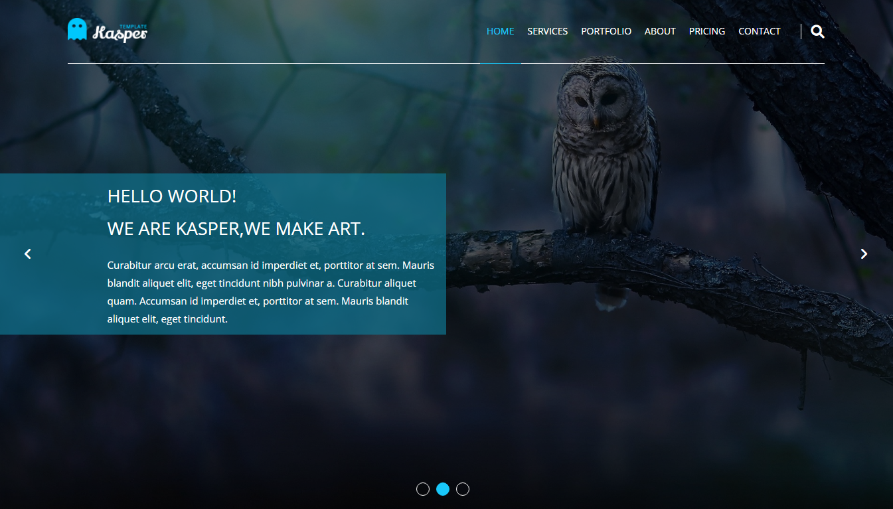

# template-two_kasper - front-end practical elzero web school

This is a solution to the [template-two_kasper - front-end practical elzero web school](https://www.graphberry.com/item/kasper-one-page-psd-template). 

## Table of contents

- [Overview](#overview)
  - [The challenge](#the-challenge)
  - [Screenshot](#screenshot)
  - [Links](#links)
- [My process](#my-process)
  - [Built with](#built-with)
  - [Useful resources](#useful-resources)
- [Author](#author)

## Overview

### The challenge

Users should be able to:

- Kasper - One Page Creative PSD Template

### Screenshot

### Links

- Solution URL: [Add solution URL here](https://your-solution-url.com)
- Live Site URL: [Add live site URL here](https://your-live-site-url.com)

## My process

### Built with

- Semantic HTML5 markup
- CSS custom properties
- Flexbox
- CSS Grid
- Mobile-first workflow

### Useful resources

- [MDN-flex](https://developer.mozilla.org/en-US/docs/Web/CSS/flex) 
- [w3schools](https://www.w3schools.com/css/css_grid.asp) .

## Author

- Frontend Mentor - [@abdou1981](https://www.frontendmentor.io/profile/abdou1981)
- Twitter - [@abdou1981_abdou](https://www.twitter.com/abdou1981_abdou)
